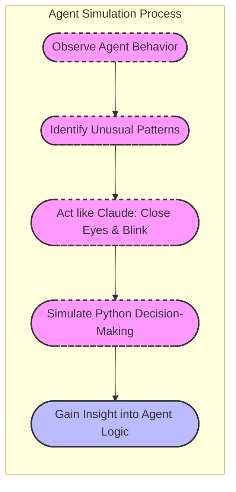

# Agents vs. Workflows in AI

This document summarizes key points from the transcript regarding AI agents and workflows, along with illustrative diagrams.

---

## 1. What Are Agents?

An **agent** in the AI context is an autonomous system where the LLM (Large Language Model):

- **Decides its own path:** It determines how many iterations or steps are needed.
- **Operates dynamically:** It can loop through actions until a satisfactory resolution is achieved.
- **Utilizes multiple tools:** It might perform tasks such as web searches, code execution, or file editing as part of its decision process.

*Example use cases include customer support interactions and iterative code improvements.*

---

## 2. Workflows vs. Agents

### Workflows

A **workflow** is a pre-defined, fixed sequence of steps where:
- **Each step is predetermined:** The process flows from one prompt to the next.
- **The number of steps is known upfront:** It’s like a rail that guides the data transformation.
- **The execution is linear:** For example, categorizing a user query before processing it further.

### Agents

An **agent**, in contrast, is characterized by:
- **Autonomy in decision-making:** The LLM chooses the next action.
- **An iterative loop:** The process continues until the goal is reached.
- **Flexibility:** It may decide to run different actions (like performing a web search or editing code) based on the current context.

---

## 3. Workflow Prompt vs. Agent Prompt

### Workflow Prompt

A workflow prompt follows a fixed, linear progression:

### Key Characteristics:

 Fixed sequence: The output of one prompt feeds directly into the next.
 Predictable flow: Designed with a known number of steps.

## Agent Prompt
### An agent prompt is open-ended and iterative, allowing the system to choose among various actions until it reaches a resolution:

#### Key Characteristics:

Dynamic decision loop: The agent continues taking actions until a satisfactory answer is found.
Tool selection: The agent can pick from multiple actions based on context.

# Empathy and Clarity: How To Design Agents

This section highlights personal experiences and insights into designing effective agents by understanding the model’s perspective and the importance of clear tool descriptions.

---

## 1. Learning Through Experience

One engineer shared a personal story about their early experience with agent design during an onboarding task (running a computer use benchmark called OSWorld). For an entire week, they observed agent trajectories that seemed counterintuitive, until they decided to "act like Claude" (the model) by simulating its behavior:

- **Simulation Technique:**  
  - Close your eyes for a minute.
  - Blink at the screen for a second.
  - Reopen your eyes and think: **"I have to write Python code to operate in this environment, what would I do?"**
  
This method helped them better understand the decision-making process of the agent.

## 2. The Importance of Empathy in Prompt Engineering
**A key takeaway is the necessity for developers to step into the model's shoes:**

### Empathetic Perspective:

Consider how the model "sees" the world. Its understanding is based solely on the context provided in the prompt.

### **Tool Descriptions Matter:**

- Many detailed prompts fail because the tools provided to the model are under-documented (e.g., parameters named only "A" and "B").
- Just like function documentation for engineers, tool descriptions need to be clear and thorough.
- Unified Context:
- Remember that all parts of the prompt (the main instructions, tool descriptions, and additional context) are fed into the same context window. Each element influences the others.

## 3. Developer Tips

### 1. Act Like the Model:
**Approach the problem from the model’s perspective. Ask yourself, "How does the model see the world with the given context?"**

### 2. Document Your Tools Thoroughly:
**Just as engineers rely on detailed API documentation, your tool descriptions should be comprehensive to ensure the model can use them effectively.**

### 3. Consider the Unified Prompt:
**Remember, all parts of your prompt—detailed instructions, tool descriptions, and contextual hints—contribute to the final behavior of the agent.**

These insights and diagrams emphasize that while agents are the "hot term" in AI right now, the success of agent-based systems hinges on thoughtful, empathetic design and clear communication within the prompt.

